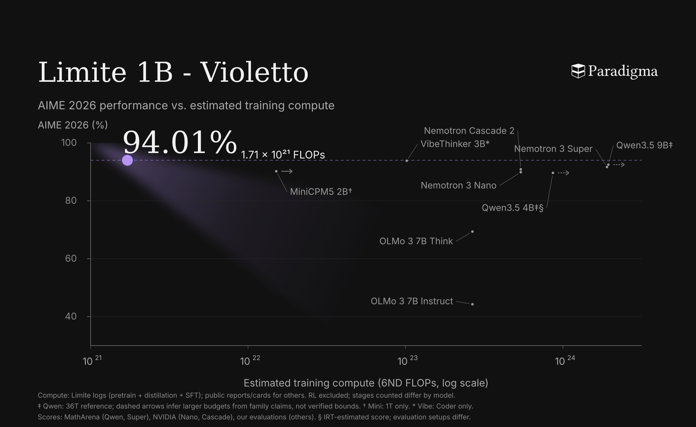

<p align="center">
  <picture>
    <source media="(prefers-color-scheme: dark)" srcset="assets/paradigma-logo-white.svg">
    <source media="(prefers-color-scheme: light)" srcset="assets/paradigma-logo-black.svg">
    
  </picture>
</p>

<h1 align="center">Limite 1B - Violetto</h1>

<p align="center">A model for high-frequency mathematical intelligence.</p>

<p align="center">
  <a href="https://huggingface.co/paradigma-inc/limite-1b-violetto">Model weights</a> ·
  <a href="https://paradigma.inc/blog/limite-1b-violetto/">Blog</a> ·
  <a href="#quickstart">Quickstart</a>
</p>

## Quickstart

**Python 3.12 · vLLM 0.26.0 · Limite plugin v0.1.0**

Use a Python 3.12 project with vLLM 0.26.0 and a compatible CUDA/PyTorch stack. Add the plugin to that project:

```bash
uv add "limite-vllm @ git+https://github.com/paradigma-inc/limite-violetto.git@v0.1.0"
```

The plugin does not install vLLM or manage the CUDA/PyTorch stack.

## Serving

With the plugin installed in the compatible vLLM environment, start Violetto:

```bash
HF_TOKEN="$HF_TOKEN" VLLM_PLUGINS=limite \
  uv run vllm serve paradigma-inc/limite-1b-violetto
```

For other Limite checkpoints, the general serving command is:

```bash
VLLM_PLUGINS=limite vllm serve paradigma-inc/<model>
```

Replace `<model>` with `limite-1b-base`, `limite-1b-base-soup`, or `limite-1b-violetto`.

Model repositories must include weights and tokenizer assets. Their `config.json` must specify:

```json
{
  "model_type": "limite",
  "architectures": ["LimiteForCausalLM"]
}
```

The remaining architecture fields are also required and checked before the inference graph is constructed. The plugin registers `LimiteConfig` itself, so serving does not require another source checkout or the native Transformers implementation. The current implementation requires tensor and pipeline parallel sizes of one.

Send the mathematical problem as a user message and use the checkpoint's bundled chat template to apply the model's mathematical prompt.

## About the model

Limite 1B - Violetto is Paradigma’s first model, designed for high-throughput solutions of difficult mathematical problems.

Pretrained from scratch with fewer than 300 billion curated tokens, then refined through supervised fine-tuning and reinforcement learning, Violetto focuses on solving one mathematical problem at a time. Its dense architecture has approximately one billion parameters and a configured context of 131,072 tokens.

This repository provides the vLLM serving implementation. The checkpoint and tokenizer are hosted on [Hugging Face](https://huggingface.co/paradigma-inc/limite-1b-violetto). Read the [release blog](https://paradigma.inc/blog/limite-1b-violetto/) for the training overview and examples.

## Evaluation

[](assets/aime26-flops.png)

*Training compute is estimated; RL is excluded and counted training stages vary by model. The figure identifies its sources and symbols; table sources are noted below.*

Selected models and mathematical benchmarks. Scores are percentages.

| Model | Params. | AIME 2026 | HMMT Feb. 2026 | APEX Shortlist | BeyondAIME |
| --- | ---: | ---: | ---: | ---: | ---: |
| **Limite 1B - Violetto** | **1B** | **94.01** | **83.62** | **50.80** | **74.25** |
| VibeThinker-1.5B | 1.5B | 70.94 | 47.25 | 10.84 | 48.06 |
| MiniCPM5-2B | 2B | 90.21 | 67.80 | 26.86 | 60.59 |
| VibeThinker-3B | 3B | 93.85 | 78.98 | 46.41 | 72.00 |
| Qwen3.5-4B | 4B | 89.66† | 72.86† | 32.51† | 61.25 |
| Qwen3.5-9B | 9B | 90.42 | 70.36 | 30.72 | 65.56 |

**Table notes.** † Results sourced from model cards or MathArena; not rerun by our team. Results reflect their respective evaluation configurations; external results may use different protocols.

## Built for mathematics

Violetto is built around mathematical reasoning, with deliberately light instruction tuning and a focus on solving one problem at a time. The [release blog](https://paradigma.inc/blog/limite-1b-violetto/) includes worked solutions and examples of how this specialization shapes its responses.

## Plugin development

```bash
uv sync --group dev
uv run pytest
uv run ruff check .
uv build
```

The implementation lives in `src/limite_vllm`. See [PROVENANCE.md](https://github.com/paradigma-inc/limite-violetto/blob/main/PROVENANCE.md) for the extraction history.

## Code license

The serving code in this repository is licensed under [Apache-2.0](https://github.com/paradigma-inc/limite-violetto/blob/main/LICENSE).

## Citation

Refer to the citation published in the [release blog](https://paradigma.inc/blog/limite-1b-violetto/).
