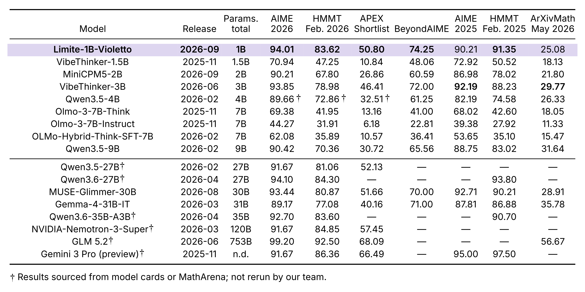

<p align="center">
  <picture>
    <source media="(prefers-color-scheme: dark)" srcset="assets/paradigma-logo-white.svg">
    <source media="(prefers-color-scheme: light)" srcset="assets/paradigma-logo-black.svg">
    
  </picture>
</p>

<h1 align="center">Limite 1B - Violetto</h1>

<p align="center">A model for high-frequency mathematical intelligence.</p>

<p align="center">
  <a href="https://huggingface.co/paradigma-inc/limite-1b-violetto">Model weights</a> ·
  <a href="https://paradigma.inc/blog/limite-1b-violetto/">Blog</a> ·
  <a href="#quickstart">Quickstart</a>
</p>

## Quickstart

**Full installation (recommended).** No extras or manual version selection are required.

**Python 3.12 · vLLM 0.26.0 · PyTorch 2.11.0 (CUDA 13.0) · Transformers 5.6.2**

On Linux x86-64 with an NVIDIA GPU and a CUDA 13.0-compatible NVIDIA driver,
install [uv](https://docs.astral.sh/uv/getting-started/installation/), then run:

```bash
git clone https://github.com/paradigma-inc/limite-violetto.git
cd limite-violetto
uv sync --locked
```

The default installation includes the plugin, vLLM, CUDA-enabled PyTorch, Transformers,
and their locked dependencies. The repository selects the PyTorch CUDA 13.0
wheel index automatically; no separate PyTorch or CUDA toolkit installation is
needed. The NVIDIA driver must already be installed on the host.

Model weights are downloaded from Hugging Face on first use.

## Serving

From the same directory, start Violetto:

```bash
VLLM_PLUGINS=limite uv run --locked vllm serve paradigma-inc/limite-1b-violetto
```

**Sampling settings:** We recommend `temperature=0.6` and `top_p=0.95`. These defaults are included in [`generation_config.json`](https://huggingface.co/paradigma-inc/limite-1b-violetto/blob/main/generation_config.json) and are loaded automatically by the vLLM command above. Explicit request parameters override these defaults, so set both values explicitly if your client supplies its own sampling settings.

For other Limite checkpoints, use:

```bash
VLLM_PLUGINS=limite uv run --locked vllm serve paradigma-inc/<model>
```

Replace `<model>` with `limite-1b-base`, `limite-1b-base-soup`, or `limite-1b-violetto`.

Model repositories must include weights and tokenizer assets. Their `config.json` must specify:

```json
{
  "model_type": "limite",
  "architectures": ["LimiteForCausalLM"]
}
```

The remaining architecture fields are also required and checked before the inference graph is constructed. The plugin registers `LimiteConfig` itself, so serving does not require another source checkout or the native Transformers implementation. The current implementation requires tensor and pipeline parallel sizes of one.

Send the mathematical problem as a user message and use the checkpoint's bundled chat template to apply the model's mathematical prompt.

### Install only the plugin

If you already manage a Python 3.12 environment with vLLM 0.26.0 and its
compatible GPU stack, build the plugin wheel from this checkout and install it
without resolving dependencies. Activate that environment first so `python` and
`vllm` refer to its executables:

```bash
uv build --wheel
python -m pip install --no-deps --force-reinstall dist/limite_vllm-0.1.0-py3-none-any.whl
VLLM_PLUGINS=limite vllm serve paradigma-inc/limite-1b-violetto
```

`--no-deps` preserves the installed runtime dependencies; you are responsible
for their compatibility. The verified versions are listed above. Building a
wheel does not install the runtime. Avoid `uv sync` in this checkout when using
this path, since it manages the complete runtime described in the quickstart.

The CUDA wheel source and lockfile are repository-level uv settings, not wheel
metadata; installing the package as a dependency of another project does not
inherit them.

## About the model

Limite 1B - Violetto is Paradigma’s first model, designed for high-throughput solutions of difficult mathematical problems.

Pretrained from scratch with fewer than 300 billion curated tokens, then refined through supervised fine-tuning and reinforcement learning, Violetto focuses on solving one mathematical problem at a time. Its dense architecture has approximately one billion parameters and a configured context of 131,072 tokens.

This repository provides the vLLM serving implementation. The checkpoint and tokenizer are hosted on [Hugging Face](https://huggingface.co/paradigma-inc/limite-1b-violetto). Read the [release blog](https://paradigma.inc/blog/limite-1b-violetto/) for the training overview and examples.

## Evaluation

[](assets/aime26-flops.png)

*Training compute is estimated; RL is excluded and counted training stages vary by model. The figure identifies its sources and symbols; table sources are noted below.*

Selected models and mathematical benchmarks. Scores are percentages.



**Table notes.** † Results sourced from model cards or MathArena; not rerun by our team. Results reflect their respective evaluation configurations; external results may use different protocols.

## Built for mathematics

Violetto is built around mathematical reasoning, with deliberately light instruction tuning and a focus on solving one problem at a time. The [release blog](https://paradigma.inc/blog/limite-1b-violetto/) includes worked solutions and examples of how this specialization shapes its responses.

## Plugin development

```bash
uv sync --locked --group dev
uv run --no-sync pytest
uv run --no-sync ruff check .
uv build
```

The optional `dev` group adds test and lint tools to the same CUDA runtime;
there is no competing CPU-only PyTorch installation. Package tests use vLLM
stubs and do not replace an actual GPU serving check.

Explore other vLLM versions in separate environments or branches. They are not
part of this verified default, and the plugin currently checks for vLLM 0.26.0.

The implementation lives in `src/limite_vllm`.

## Code license

The serving code in this repository is licensed under [Apache-2.0](https://github.com/paradigma-inc/limite-violetto/blob/main/LICENSE).

## Citation

Refer to the citation published in the [release blog](https://paradigma.inc/blog/limite-1b-violetto/).
